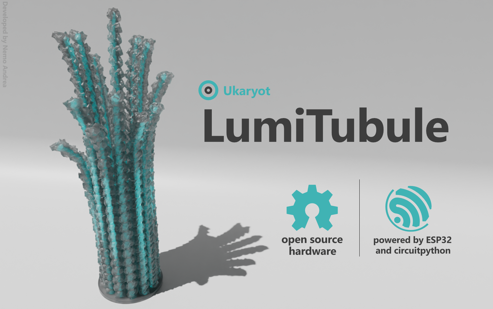

> **warning** 🚧 Under Construction - There is still a lot of work to be done on this project. Have a look at issues if you want to contribute (e.g. review PCB) or check back later when the project is getting closer to release 👷

## LumiTubule - open hardware decorative led sculpture

LumiTubule is a simple decorative lamp in the shape of a [microtubule]() that can be programmed to respond to events (e.g. emails). While primarily decorative, the PCB comes with a temperature and humidity sensor and a basic accelerometer for user interaction - and a stemma QT port in case you want to add more sensors!

It's all powered by a small USB-C power supply, so it barely takes up any desk space.

The PCB design, 3D printable files and bill of materials are all available, so you can put together your own LumiTubule. If you would like to have one, but would rather not go through the assembly process, you can get in touch. 

### Components

There are 4 key components that make up the LumiTubule

1. The custom PCB with ESP32 microcontroller and onboard sensors
2. A [15W USB-C power supply](https://www.raspberrypi.com/products/type-c-power-supply/)
3. The 3D printed microtubule sculpture 
4. The 13 flexible LED filaments that sit inside the sculpture
