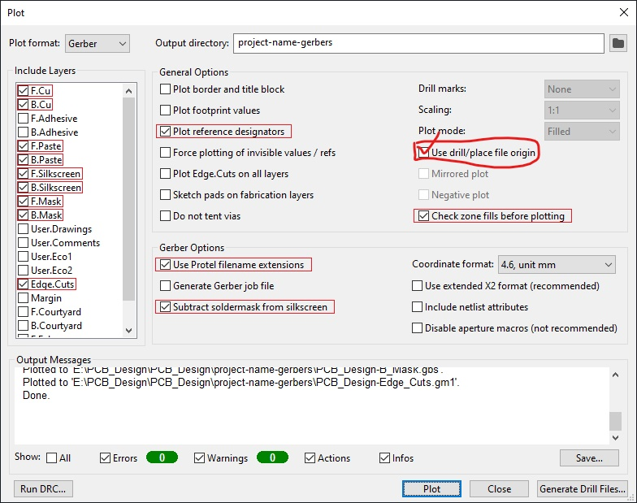

### LumiTubule PCB

The LumiTubule PCB is generated with KiCad 6.0

The following plugins were used:

* [Teardrops plugin](https://github.com/NilujePerchut/kicad_scripts/tree/master/teardrops) (manual install - in PCBnew go to `tools` > `external plugins` > `open plugin directory`) 
* [Rounded tracks plugin](https://github.com/mitxela/kicad-round-tracks) (via plugin manager)

### Graphics

The graphics for the board are primarily created in Affinity Designer, with the help of [Inkscape](https://inkscape.org/) for some of the outline traces and image binarisation.

Some weird quirks during drawing process

- KiCad seems really picky about when it will render the hole in the board. The outline of the board has a lot of polygons. I am not sure what property of the inner circle makes it work better, but be aware that some frustrations may occur here if you try to change it.

### Considerations

> **Note** The points below provide some insight into why certain parts were selected. If you spot any errors in the calculations or reasoning, feel free to let me know!

**LED filament current setting resistor value `R_ext`**

The LED filaments can handle about 100mA current (more in practice seems fine), so let's aim for that value. We need to chose `R_ext` for the `TLC59108` and find an internal configuration to match. 

We look [in the datasheet](https://www.ti.com/lit/ds/symlink/tlc59108.pdf) and glance at section `10.1.1.2` ('adjusting the output current') . We see that the output current will depend on `R_ext`, `VG`, and `CM`. The latter two are configurable via internal register `IREF`. The default value of `CM` is 1, which sets `I_out/I_ref` = 15, and is listed as suitable for the 10mA-120mA regime; so we do not need to adjust this.   

`VG` is a more complicated value, being composed of the internal register value `HC` and `CC[5:0]`. Its default value is ~1 (0.992), which means that `V_ext` =1.25V (which has the following dependence: `V_ext = 1.26 * VG`).

Now we can put it together. We want `I_out`=100mA, so we need `I_ext` to be 100/15= 6.67mA. `I_ext` is simply set by `V_ext/R_ext`. So we need `R_ext` = 1.25/( 6.67 E-3) = **187.4 Ohm**. Dissipation in this resistor will only be (6.67mA)^2 * 187 = 10mW, so we can pretty much pick any package size.

### Generating fabrication outputs

We can generate a BOM from the schematic editor. We use a slightly modified version of [this custom script](https://gist.githubusercontent.com/arturo182/a8c4a4b96907cfccf616a1edb59d0389/raw/2c9191c0f1fe5471db3362ccf29f71d3235af4d4/bom2grouped_csv_jlcpcb.xsl) where we fetch part numbers from the custom field name 'JLCPCB ref' instead. You can see the value of this field in the schematic editor for each component. This is based on advice [from JLCPCB](https://support.jlcpcb.com/article/84-how-to-generate-the-bom-and-centroid-file-from-kicad).

We then turn to the PCB editor. We first need to run the [Rounded tracks plugin](https://github.com/mitxela/kicad-round-tracks). Run it with default parameters, and make sure you generate a new file. 

Next up, run the [Teardrops plugin](https://github.com/NilujePerchut/kicad_scripts/tree/master/teardrops). Use the following settings.

Now we can generate the `.gbr` files. We do this following [the suggestions by JLCPCB](https://support.jlcpcb.com/article/194-how-to-generate-gerber-and-drill-files-in-kicad-6). **In addition, we need to tick the place file origin option, as the PCB uses a virtual origin.** In short:

And for the drill file (we want to again pick the `drill/place file` origin:

Finally we need to generate the placement file. This is done from the PCB editor under `fabrication outputs`. We generate a `.pos` file. Per [instructions from JLCPCB](https://support.jlcpcb.com/article/84-how-to-generate-the-bom-and-centroid-file-from-kicad) we start with these settings in `KiCad`:

And then in the resulting `.csv` we change the following bits:

